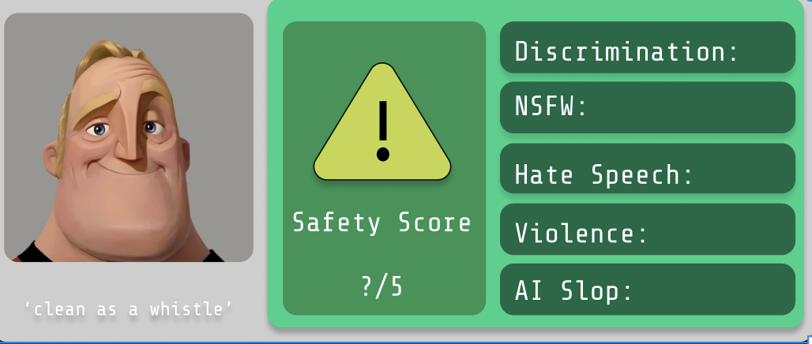

# SafeLink 
- Created for Catalyst 2025
- Role: core developer

A browser-based tool for evaluating the safety and originality of content behind URLs, designed and built during a 48-hour hackathon by first-year students.

## Inspiration

The idea was inspired by years of using the Google Dictionary extension, particularly its intuitive pop-up feature for quick definitions. We wanted to create something similarly seamless but focused on analyzing web content for safety, NSFW, discrimination, and AI-generated text. We took inspiration from their codebase to design our tool-snippet pop-ups and image loading features.

## Features

### 1. Content Safety Analysis
- **Perspective API Integration:** Aggregates scores for hate, harassment, violence, and sexually explicit content.
- Uses a mathematical aggregation that emphasizes any significant risk—multiplying "safe probabilities" and inverting the result, so a single high-risk category drives the overall alert.
- Threshold for category significance is set at 20% (0.2) based on empirical testing.

### 2. AI Detection ("Slop Meter")
- Attempts to detect AI-generated content using available tools.
- Originality.AI and CopyLeaks considered, but not integrated due to cost constraints ($30 API key) and lack of free credits.
- GPTZero and similar tools were too slow (~500ms per 300 words) for real-time detection.

### 3. Backend Processing Flow
1. Identify the URL to check.
2. Open the link in a new browser tab and extract HTML data.
3. Parse and concatenate `
` and `<alt>` tag content for analysis.
4. Send to Perspective API for scoring.
5. Return category results and display in the frontend.

### 4. Frontend
- Pop-up snippet inspired by Google Dictionary, with auto-hide and image preloading.

## Technical Challenges & Lessons
- **API Key Management:** Used a `.env` file for secure and flexible API key handling.
- **Rate Limits:** Perspective API allows one call per second but supports payloads up to 1MB.
- **HTML Extraction:** Current approach involves opening tabs, injecting CSS for whiteout, and scraping. Needs refinement to avoid infinite loops on general links (e.g., `reddit.com`).
- **Parallel Processing:** Considered for faster AI detection, limited by provider credit/cost.
- **Manual HTML Upload:** Planned but not implemented.

AI generated part over....
---------
Say hello to grammatical errors

Things we would’ve done if we were more tech savvy and not first years:
1. Ensuring that all the 
 tags and <alt> tags that represent all of the descriptions are concatenated into one prompt that can be sent to perspectiveAPI. Reasoning: perspective only allows one api call per second, however the allowed file/input size is 1MB which for just submitting a string is a lot more than we’ll ever need to tell if something is suss (here’s a source to make my high school English teacher proud)
2. Fixing the logic behind the html extraction logic, currently the implementation that we found worked the best was opening the file in another chrome tab, injecting a css script to make the whole page white, and then extracting the html data before automatically closing the tab. Currently it’s kinda fetching but is prone to infinite loop if given a general link (reddit.com, needs something more specific like)
3. Manual link upload for the html 
4. AI slop
